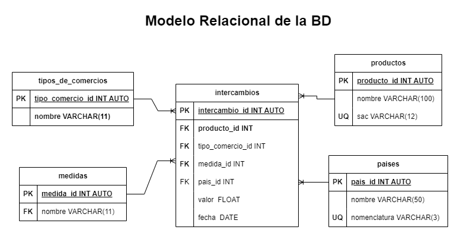
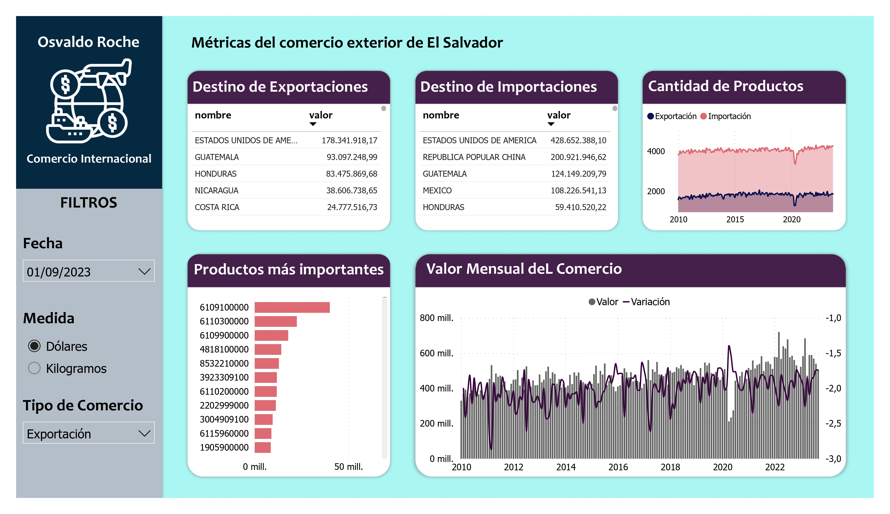

# 1. Seguimiento de Comercio Exterior

Proyecto donde se mostrará la evolución de las principales variables del comercio exterior salvadoreño, con sus socios y tipo de productos de exportación e importación. Los datos están tomados del BCR desde el 2010 bajo la nomenclatura SAC, divididos por archivos de importación y exportación. 

## 1.1. Problema

¿Cuál es la tendencia histórica mensual del _comercio por productos_ de El Salvador con sus socios comerciales desde 2010 a la actualidad? 

## 1.2. Preguntas

1. ¿Cuáles son los 10 principales países a donde van las exportaciones salvadoreñas?
2. ¿Cuáles son los 10 principales países de donde provienen las importaciones?
3. ¿Cuál es la tasa de crecimiento anual de las exportaciones y exportaciones?
4. ¿Cuántos productos se exportan por año y cuánto han crecido?
6. ¿Cuáles son los principales productos exportados e importados?

# 2. Diseño de la Base de Datos

## 2.1. Entidades

### productos **(EC)**

- producto_id  **(PK)**
- nombre
- sac **(UQ)**

### intercambios **(ED|EP)**
- intercambio_id
- producto_id **(FK)**
- tipo_comercio_id **(FK)**
- medida_id **(FK)**
- pais **(FK)**
- valor
- fecha

### tipo_de_comercio **(EC)**

- tipo_comercio_id **(PK)**
- nombre

### medidas **(EC)** 

- medida_id **(PK)**
- nombre

### paises **(EC)**

- pais_id **(PK)**
- nombre
- nomenclatura **(UQ)**

## 2.2. Relaciones

1. Un **intercambio** se hace con un **país** y los **países** pueden hacer más de un **intercambio**. (_1 - M_)

2. Un **intercambio** posee uno **producto** y un **producto** puede estar en muchos **intercambios**. (_1 - M_)

3. Un **intercambio** se hace bajo un **tipo de comercio** y el **tipo de comercio** tiene muchos **intercambios**. (_1 - M_)

4. Un **intercambio** tiene una **medida** y a la **medida** le corresponden varios **intercambios** determinado. (_1 - M_)

## 2.3. Diagramas

## 2.4. Explicación de Entidades

+ *productos*: Es el producto establecido según la nomenclatura SAC de comercio.
+ *tipo_comercio*: El comercio del producto puede ser Exportación o Importación. 
+ *intercambio*: El intercambio del producto se da en una cantidad determinada, bajo una medida determinada y un tipo de comercio determinado. 
+ *medida*: Los productos se registran en Kilogramos (Kg) y Dólares (USD) en aduana.
+ *paises*: El comercio se da con diferentes países llamados socios comerciales.
+ *cantidades*: Esto es un cálculo adicional a la BD ya con los datos.
+ *Valor*: Una cantidad ya dada a la BD

## 2.5. Reglas de negocio

### Productos

1. Crear un producto
2. Leer todos los productos
3. Leer un producto en particular
4. Actualizar un producto
5. Eliminar un producto

### Cantidades

1. Crear una cantidad
2. Leer todas las cantidades
3. Leer una cantidad con una condición en particular
4. Actualizar una cantidad
5. Eliminar una cantidad
6. Sumar la cantidad intercambiada de un socio en particular
7. Sacar el porcentaje de la cantidad respecto a la suma de todos las cantidades

### medidas

1. Crear una medida
2. Leer todas las medidas
3. Leer una medida en particular
4. Actualizar una medida
5. Eliminar una medida
6. Sacar el porcentaje del valor respecto al total del valor para una fecha y socio determinado. 

### tipo_de_comercio

1. Crear un tipo de comercio
2. Leer todos los tipos de comercio
3. Leer un tipo de comercio con una codición en particular
4. Actualizar un tipo de comercio
5. Eliminar un tipo de comercio

### paises

1. Crear un pais
2. Leer todos los paises
3. Leer un pais con una codición en particular
4. Actualizar un pais
5. Eliminar un pais

# 3. Informe Final

