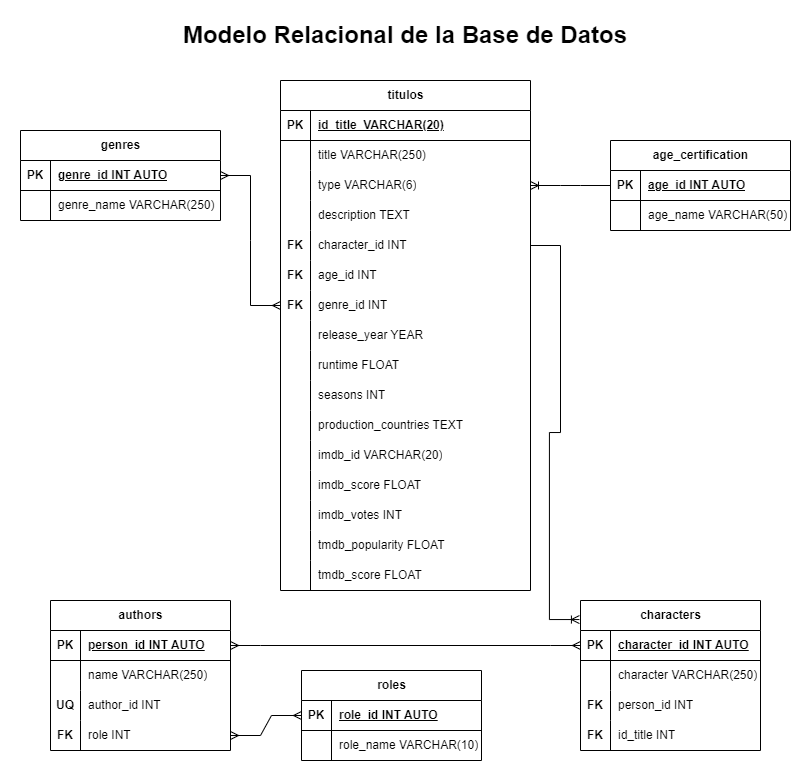
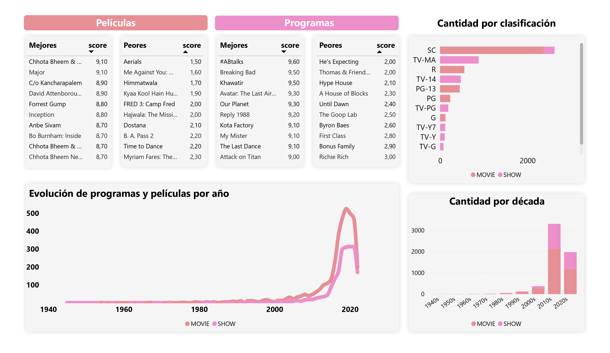
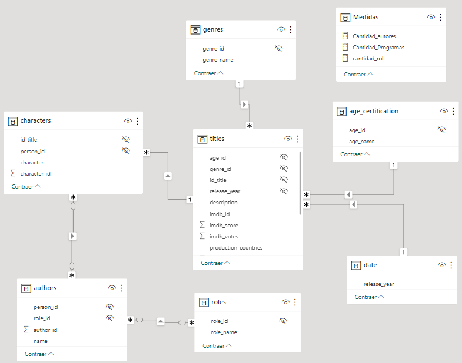
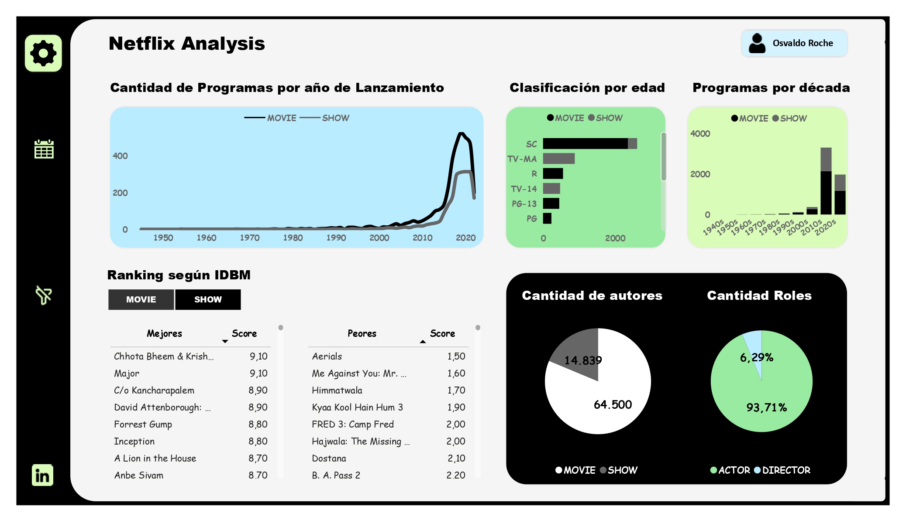

# 1. Problema Empresarial

Netflix quiere recopilar información útil sobre sus programas y películas para sus suscriptores a través de sus conjuntos de datos. El problema es que están trabajando con demasiados datos (aproximadamente 82.000 filas de datos combinadas) y no están seguros de cómo analizarlos y extraer información significativa de ellos de forma eficaz. Necesitan una solución de análisis de datos sólida y escalable para manejar la gran cantidad de datos y descubrir patrones y tendencias valiosos.

# 2. Resolución esperada del Problema.

Para ayudar a Netflix a recopilar información valiosa de su extenso conjunto de datos de películas y programas, utilizaré SQL y una herramienta de visualización de datos como Power BI para extraer información relevante y realizar análisis profundos. Al aprovechar las funciones de SQL, puedo descubrir métricas clave como calificaciones de espectadores, tendencias de popularidad, preferencias de género y patrones de audiencia. Una vez que se hayan extraído y preparado los datos, aprovecharé Power BI para presentar los hallazgos. Esto permitirá la exploración interactiva de los datos, lo que permitirá a las partes interesadas de Netflix obtener información útil a través de cuadros, gráficos y visualizaciones interactivas visualmente atractivos. Planeo crear un panel dinámico en Power BI que permita a los usuarios profundizar en géneros de películas, datos demográficos de espectadores o regiones geográficas específicos.

# 3. Datos

La información utilizada pertenece al conjunto de datos de Netflix que contiene dos archivos:

Títulos: 5000 títulos únicos y 15 columnas.
Crédito: 77000 créditos y 5 columnas

# 4. Preguntas que responden el problema

1. ¿Qué películas y programas de Netflix se ubicaron entre los 10 primeros y los 10 últimos según sus puntuaciones de IMDB? 
2. ¿Cuántas películas y programas se encuentran por cada década en la biblioteca de Netflix?
3. ¿Cuántas películas y shows se producen por año?
4. ¿Qué géneros son los más comunes en películas y shows?
5. ¿Cómo impactaron las certificaciones de edad en la producción de películas y shows?

# 5. Diseño de la Base de Datos

Dado que la base de datos está mal estructurada se debe normalizar a través de las 3 formas normales. El resultado final son 6 tablas. 

## 5.1. Entidades Actuales

### titulos (EC|ED)

- id_title **(PK)**
- title
- type
- description
- release_year
- age_certification
- runtime
- genres
- production_countries
- seasons
- imdb_id
- imdb_score
- imdb_votes
- tmdb_popularity
- tmdb_score

### credits (ED)

- person_id **(PK)**
- id_title **(FK)**
- name
- nickname
- role

## 5.2. Entidades normalizadas

### titulos **(ED|EP)**

- id_title **(PK)**
- title
- type
- description
- character_id  **(FK)**
- age_id **(FK)**
- genre_id **(FK)**
- release_year
- runtime
- seasons
- production_countries
- imdb_id
- imdb_score
- imdb_votes
- tmdb_popularity
- tmdb_score

### age_certification **(EC)**

- age_id **(PK)**
- age_name

### genres **(EC)**

- genre_id **(PK)**
- genre_name

### authors **(EC)**

- person_id  **(PK)**
- author_id
- name
- role_id **(FK)**

### character **(EC)**

- character_id  **(PK)**
- character
- person_id **(FK)**
- id_title **(FK)**

### roles **(EC)**
- role_id **(PK)**
- role_name

## 5.3. Relaciones

1. Un **programa** tiene una **clasificación** y una **clasificación** está dada para muchos **programas**. _(1 - M)_
2. Un **programa** tiene uno o más **generos** y un **género** está dado para uno o muchos **programas**. _(M - M)
3. Un **personaje** pertenece a un **programa** y un **programa** tiene muchos **personajes**. _(1 - M)_
4. Un **autor** protagoniza uno o más **personajes** y un **personaje** es protagonizado por uno o más **autores**._(M -M)_
5. Una **persona** tiene uno o más **roles** y un **rol** es para una o muchas **personas**.  _(M - M)_

## 5.4. Modelo Relacional de la Base de Datos (Modelo Lógico)

# 6. Modelado de la Base de Datos y Diseño de Informe

Este ejercicio se hará de 2 formas:

**1. Primera forma:** En este caso se modelo físicamente en MySQL y la BD fue conectada luego a Power BI, por eso era necesario diseñar y modelar la lógica de negocio a manera de facilitar el proceso ETL dentro de PBI. Para ello se crearon las consultas directas a la basa de datos por medio de vistas, de modo que las tablas no estarán relacionadas dentro de Power BI, pero se garantiza la actualización automática de los datos si es necesario. El resultado final fue el siguiente: 

**2. Segunda Forma:** En este caso se modelará directamente dentro de Power BI después de hacer el proceso ETL, para poner en práctica el conocimiento tenido de la herramienta. De la base de datos MySQL solo se obtuvieron las tablas originales, no los cálculos.

El modelado final de las relaciones entre entidades dentro de Power BI fue el siguiente: 

Y el diseño final del dashboard fue el siguiente:

